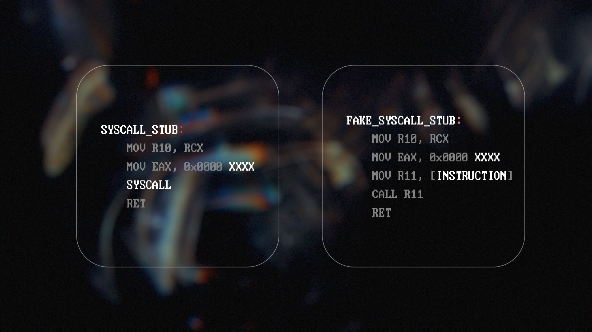

# Reverse Shell with Indirect Syscalls

At the lowest of levels, making a connection and creating a process is difficult.
Utilizing knowledge of system behavior, a reverse shell can be built with these low level calls.
This stands as an implementation of using indirect syscalls to establish a reverse shell.

**Disclaimer**: The purpose of this is for educational purposes and testing only.
Do not use this on machines you do not have permission to use.
Do not use this to leverage and communicate with machines that you do not have authorization to use.

## Creating a reverse shell.

###### Follow with `examples/simple`

Windows offers functions with several purposes, but key functions will be for **connecting** and **creating processes**.
The `CreateProcessA` function can create a process; 
A structure invloved in creating the process is `STARTUPINFO`.
Within the structure is are fields for standard handles.
This means process standards can be piped via a network socket.

Vital functions for creating a network socket are: `WSAStartup`, `WSASocketA`, & `connect`.
To receive a handle to a network socket (with all Windows features attached), you must first load necessary libraries through `WSAStartup`.
`WSASocketA` checks if `WSAStartup` has been executed, and create a handle used for connections.
With the handle, you may then connect to a remote host with `connect`.

## Lowering the level.

When observing the execution flow of a reverse shell, we see what low level functions are called from higher ones.
At a minimum we need a socket and something to connect.
Observe the call stack for `WSASocketA`.

```
→ WS2_32!WSASocketA
→ WS2_32!WSASocketW
→ mswsock!WSPSocket
→ mswsock!SockSocket
→ ndll!NtCreateFile
```

At the loweset level `NtCreateFile` creates a handle from an end point given from the parameters.
The driver we communicate with is `afd.sys` in which we create a handle from `AfdOpenPacketXX` seen in the extended attributes.
This handle is a socket, but is no different than a file handle.

The socket can be controlled in a way that describes a network connection.
Before a connection is made, the socket needs a bound address and port.
A connection can then be made to a remote address and port.
Observe the call stack for `connect`.

```
→ WS2_32!connect
→ mswsock!NSPStartup
→ ndll!NtDeviceIoControlFile
```

All behavior from a handle can be modified with `NtDeviceIoControlFile`.
Depending on the control code given, the kernel will change information regarding the handle in a way the caller describes.
The 2 control behaviors we are looking for are binding and connecting. 2 Unique calls are performed with the control codes `0x12003 && 0x12007`.
The structures passed are not big;
While manipulating the handle, we can bind and connect.

Finally, creating the process.
It is important we can pass standard handles correctly, so the process is able to inherit/use them.
Observe the call stack for `CreateProcessA`.

```
→ kernel32!CreateProcessA
→ kernelbase!CreateProcessA
→ kernelbase!CreateProcessInternalA
→ kernelbase!CreateProcessInternalW
→ ndll!NtCreateUserProcess
```

Creating the process at the lowest level is probably the most difficult thing to recreate.
The structure that matters most is `UserProcessParams`.
When the structure is initialized correctly, it contains window and standard handle information.

## Replicating the behavior.

To create the handle, `NtCreateFile` is used.
It's important to try and re-create the exact calls, so all behaviors remain alike.
The specific items that we need are `ObjectAttributes.Attributes = 0x42`;
The value depicts handle creation that becomes "passable/inheritable".

```c
NTSTATUS
NTAPI
NtCreateFile(
        PHANDLE                 File,
        ACCESS_MASK             DesiredAccess,
        POBJECT_ATTRIBUTES      ObjectAttributes,
        PIO_STATUS_BLOCK        IoStatusBlock,
        PLARGE_INTEGER          AllocationSize,
        ULONG                   FileAttributes,
        ULONG                   ShareAccess,
        ULONG                   CreateDisposition,
        ULONG                   CreateOptions,
        PVOID                   Buffer,
        ULONG                   BufferLength
);
```

For the 2 handle modifications, `NtDeviceIoControlFile` is used.
The call that I wanted to re-create specifically is "bind".
For the most natural behavior, automatic address and port bind is best.
The specific item to preserve is `AfdindSocket.dwFlags = 0x2`;
The value depicts automatic address/port binding.

```c
NTSTATUS 
NTAPI 
NtDeviceIoControlFile(
        HANDLE                  File,
        HANDLE                  Event,
        PIO_APC_ROUTINE         ApcRoutine,
        PVOID                   ApcContext,
        PIO_STATUS_BLOCK        IoStatusBlock,
        ULONG                   IoControlCode,
        PVOID                   InputBuffer,
        ULONG                   InputBufferLength,
        PVOID                   OutputBuffer,
        ULONG                   OutputBufferLength
);
```

For the process creation, `NtCreateUserProcess` is used.
The one important factor is to make sure the standard handles are correctly placed within the `UserProcessParamters` structure.

```c
NTSTATUS
NTAPI
NtCreateUserProcess(
        PHANDLE                         hProcess,
        PHANDLE                         hThread,
        ACCESS_MASK                     ProcessDesiredAccess,
        ACCESS_MASK                     ThreadDesiredAccess,
        POBJECT_ATTRIBUTES              ProcessObjectAttributes,
        POBJECT_ATTRIBUTES              ThreadObjectAttributes,
        ULONG                           dwProcessFlags,
        ULONG                           dwThreadFlags,
        PRTL_USER_PROCESS_PARAMETERS    pProcessParameters,
        PPS_CREATE_INFO                 pCreateInfo,
        PPS_ATTRIBUTE_LIST              pAttributeList
);
```

## Indirectly performing a system call.

###### Follow with `examples/advanced`



Within `ntdll.dll` there are multiple functions that include `syscall`.
These functions are the hand off from userland to kernel mode.
Most EDRs will hook into them and inspect paramters before execution.
To avoid this is quite simple: Within our code, include a function that calls the address of the instruction.

Imagine a scenario where `ntdll.dll` has been parsed.
We have the address to a specific function we want, now we need to know where the `syscall` takes place.
The instruction `0x0F05` marks a `syscall`.
Read over the bytes at that function, find the syscall, and store it anywhere;
Store the instruction in a register, then call the register as a function.